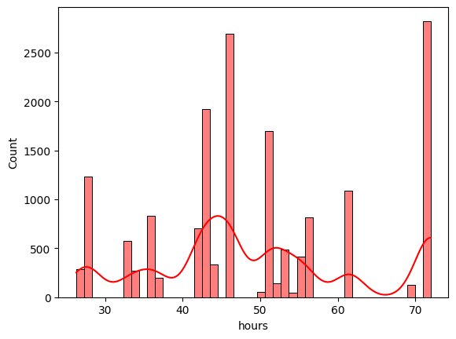
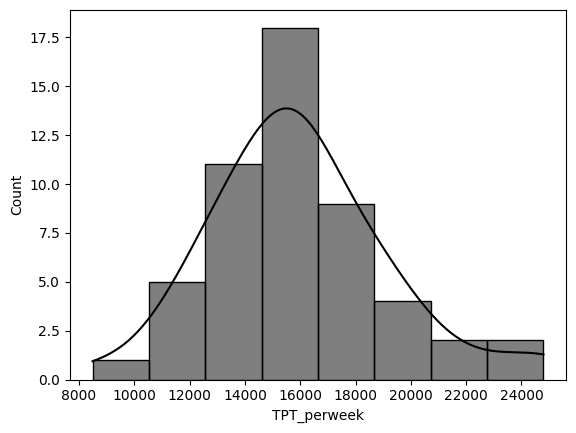

# Blast-Freezer-Truck-Schedule-Optimization-for-Supply-Chain-Efficiency

### Project Overview
This project developed a strategic scheduling model for Interchange Group Inc.'s blast freezer, optimizing truck schedules to balance freezer capacity with operational costs, based on data-driven insights.

### Key Features
Utilized Monte Carlo simulations to model freezer capacity usage.
Analyzed historical shipment data to inform scheduling decisions.
Achieved optimal balance between demand and resource utilization.

### Project Outcome
Determined the optimal scheduling of 25-30 trucks weekly, enhancing resource efficiency and minimizing cost without overburdening the freezer's capacity.

### Conclusion
The project exemplifies the effective use of analytics in operational efficiency, providing a replicable model for logistics optimization in the food supply chain sector.

### Distribution of Freezing Hours in Blast Freezer Operations

### Weekly Total Processing Time Distribution in Blast Freezing

